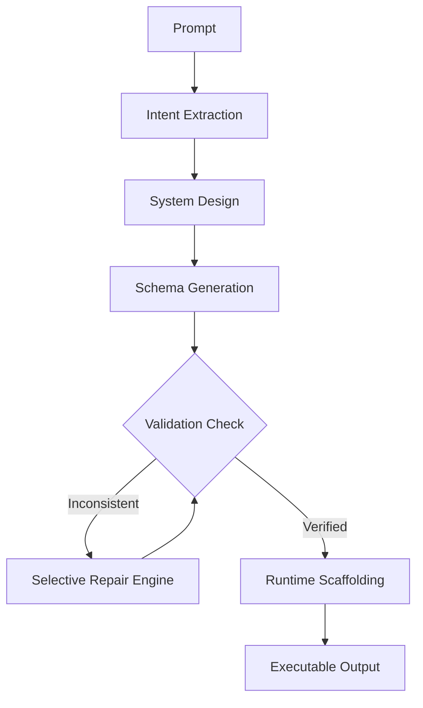

# AI Software Generation Compiler

An advanced multi-stage AI compilation platform that deterministically translates natural language intents into robust, cross-layer consistent, and executable software architectures.

## Overview

Unlike standard chat-based LLM workflows that output raw strings, this system acts as a true compiler. It breaks the generation process into a pipelined abstraction: extracting intent, designing the system, generating strict Pydantic-enforced schemas, and passing those schemas through a **Validation Repair Engine**. Only once all database references, API payloads, UI routes, and authorization policies are proven to be perfectly cross-layer consistent are the execution artifacts scaffolded to disk.

## Key Features
- **Multi-Stage Pipeline**: Isolated reasoning layers (Intent → System Design → Strict Schema).
- **Deterministic Generation**: Enforces `temperature=0` with `instructor` JSON extraction.
- **Validation & Repair Engine**: Automatically catches missing references and logically repairs schema inconsistencies in a tight feedback loop without user intervention.
- **Selective Regeneration**: Surgically patches only failing layers (e.g., UI Schema) without wasting tokens on a full system regeneration.
- **Runtime Scaffolding**: Writes real HTML/JS/CSS/SQL to disk.
- **Cache-First Execution**: MD5-hashes inputs and schemas to persist deterministic compilations, saving 100% of API tokens on re-runs.
- **Observability Console**: A professional frontend dashboard exposing compile metrics, cache hits, API savings, and live file trees.

## Architecture Diagram



## Tech Stack
- **Backend**: FastAPI, Python 3.10+
- **Frontend**: Vanilla JavaScript, HTML5, CSS3, Lucide Icons
- **LLM Abstraction**: OpenRouter, Groq, OpenAI SDK
- **Data Validation**: Pydantic, Instructor

## Project Structure
```text
├── backend/
│   ├── config.py         # Centralized provider configuration
│   ├── main.py           # FastAPI entrypoints
│   ├── pipeline.py       # Orchestration pipeline
│   ├── provider.py       # Multi-provider LLM abstraction
│   ├── repair.py         # Validation & backoff logic
│   ├── runtime.py        # Abstract execution simulation
│   ├── scaffolder.py     # Physical file rendering
│   └── schema.py         # Pydantic core models
├── frontend/             # Static Observability Console
├── datasets/             # Benchmarking Prompts
└── evaluate.py           # System Evaluation Framework
```

## Setup Instructions
1. Clone the repository.
2. Create a virtual environment: `python -m venv venv && source venv/bin/activate`
3. Install dependencies: `pip install -r requirements.txt`
4. Copy `.env.example` to `.env` and add your API keys.

## Environment Variables
The system uses a `ProviderRegistry` for robust LLM routing.
```env
OPENROUTER_API_KEY="sk-or-v1-..."
# Fallback provider:
GROQ_API_KEY="gsk_..."
```

## Running the Platform
1. **Start the Backend**: 
   `uvicorn backend.main:app --port 8080 --reload`
2. **Start the Frontend**: 
   Serve the `frontend/` directory (e.g., `python -m http.server 3000 -d frontend`).

## Running Evaluations
The evaluation framework is optimized to prevent token exhaustion.
```bash
python evaluate.py --mode QUICK_EVALUATION
python evaluate.py --mode FULL_EVALUATION
```
**Deterministic Benchmarking & Cost-Aware Engineering**
The evaluation framework uses deterministic cached compilation artifacts to reduce redundant API usage while preserving perfect reproducibility. This cache-first positioning is a strict production optimization to ensure evaluation stability, avoiding unnecessary LLM token expenditure on identical dataset prompts.

## Generated Artifacts
When a compilation succeeds, all files are physically written to the `generated_apps/` directory, structured exactly as defined in the architectural schema.

## Observability Features
The dashboard tracks the underlying metrics of the `ValidationRepairEngine`:
- **Cache Hit Rate**
- **Estimated API Cost Avoided**
- **Compile Latency**
- **Selective Repair Activations**
- **Cross-Layer Integrity Status**

## Engineering Tradeoffs
- **Deterministic Generation over Creativity**: `temperature=0` is strictly enforced to prevent schema drift, sacrificing creative LLM prose for parseable JSON reliability.
- **Cost vs Quality**: Using heavy reasoning models (like `deepseek-chat`) for the initial monolithic generation, but maintaining lightweight fallback chains (`llama-3.1-8b`) for targeted surgical schema repairs.
- **Cache-First Execution**: The system trades storage (disk-based JSON caching) for speed and cost-reduction, a necessary tradeoff when benchmarking AI infrastructure loops.
